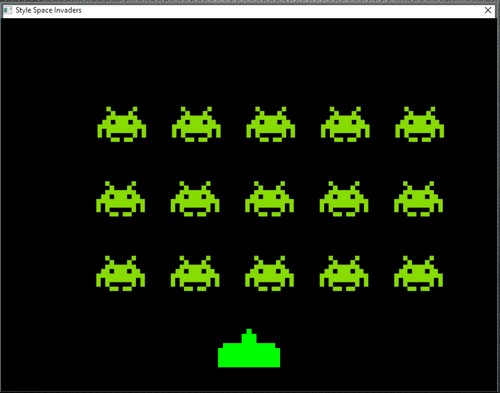

# 2D-Tutoriels
Quelques exercices simples pour des applications 2D codées avec le langage PureBasic.

- 01 - Afficher un sprite.
- 02 - Déplacer un sprite.
- 03 - Exercice de tir.
- 04 - Dessiner dans un sprite.
- 05 - Rotation d'un sprite.
- 06 - On nous attaque.
- 07 - Style Space Invaders.

